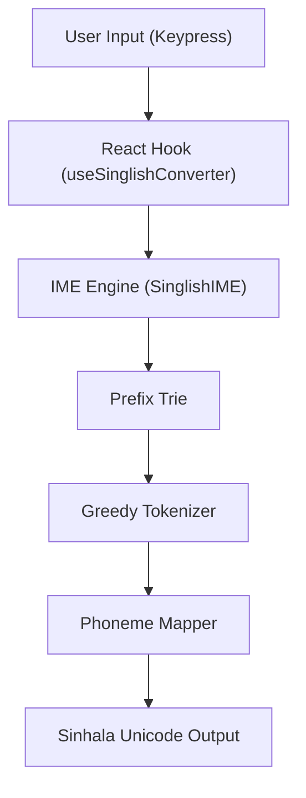

# Architecture

The Singlish engine is built on a layered architecture designed to separate the **stateless** phonetic conversion logic from the **stateful** input method editor (IME) behavior required for real-time typing.

## High-Level Overview

## Core Components

### 1. Prefix Trie (`ime-engine.ts`)

The heart of the real-time engine is a **Prefix Trie**. This data structure stores all valid Singlish sequences (e.g., `k`, `ka`, `kru`, `zdha`).

- **Why a Trie?**
  When a user types `k`, we don't know if they intend to type `ka` (ක), `kra` (ක්‍ර), or just `k` (ක්). The Trie allows us to:
  - **Validate prefixes**: "Is `zqa` a valid start of a character?"
  - **Lookahead**: Determine if we should wait for more input or commit the current buffer.

### 2. Greedy Tokenizer (`converter.ts`)

For converting full strings (e.g., pasting text), we use a **Greedy Tokenizer**. It scans the input string and attempts to match the longest possible Singlish pattern at each position.

- **Algorithm**:
  1. Iterate through the input string.
  2. At each index, check patterns in descending order of length (4 chars down to 1 char).
  3. If a match is found, consume those characters and map to the corresponding phoneme.
  4. Advance the index.

### 3. Context-Aware Phoneme Mapper

Converting Singlish tokens to Sinhala isn't a 1-to-1 mapping. It depends on context:

- **Inherent Vowels**: Consonants like `k` imply an inherent `a` sound unless followed by a vowel or a *hal* (virama).
- **Modifier Placement**: Vowel signs (pili) must be attached to the preceding consonant.
- **Conjuncts**: Special sequences like `y` after a consonant trigger *Yansaya* (e.g., `kya` -> `ක්‍ය`), and `r` triggers *Rakaransaya* (e.g., `kra` -> `ක්‍ර`).

The `phonemesToSinhala` function in `converter.ts` handles this state machine logic.

## State Management

The `SinglishIME` class maintains:
- **Committed Text**: Text that has been fully resolved and cannot change.
- **Pending Buffer**: The current sequence of keystrokes being processed (e.g., `k`, `ka`, `kar`).

This separation ensures that backspacing works correctly on the *Singlish* buffer before it is committed as Sinhala characters.
